# simple.NSTDA.gama2

# GAMA models for BiodiVRestorer VU#2 - User Documentation

---

## Overview

### About BiodiVRestorer VU#2

The BiodiVRestorer Virtual Universe version 2 (VU#2) 

- **The Forest Monitoring model**: simulates an interactive game in which players protect seedlings\
from three major threats wildfires, alien species, and weeds over a 2-year period,\
so that the seedlings collected from the Forest Trails model in VU#1 can grow according to the forest restoration plan.\
   This model is integrated with:
   - **Seedling Guardian Console** (optional) : a web application that serves as a decision-support system. It helps players control the three threats and provides a dashboard displaying each team’s total score, number of coins, a tree growth stage overview, a stacked view of remaining trees by growth state per round, and the number of remaining trees by species.

### Learning Objectives
- Raising awareness about biodiversity loss, fostering an understanding of its causes and impacts.
- Providing immersive VR experiences on best practices for forest restoration, specifically targeting youth as the future generation.
<!--
- [Skills developed through the VU]
-->

### Target Audience
- Age group: 15-18 Years old
- Educational level: Secondary School
- Language(s) available: Thai, English

<!--
-->

---

## System Requirements

### Server

- GAMA Platform [GAMA Platform - 2025.6.4]
   - With the additional VR plugin from [this link](https://github.com/project-SIMPLE/simple.toolchain/tree/Unity-6/GAMA%20Plugin).
- SIMPLE Webplatform

- Seedling Guardian Console (optional)
   - Python version 3.12
   - Library Requirement
      - uvicorn
      - fastapi
      - websockets
<!--
- BioDivRestorer latest release
-->

### VR Headsets
- Meta Quest 3
- BiodiVRestorer2.apk latest release

---

## Installation Guide

### Unity VR Application Installation

1. Download BiodiVRestorer2.apk from [download location](https://github.com/project-SIMPLE/simple.NSTDA.unityVRproject/releases) to your computer.
2. Connect the headset to your computer with a USB-C cable and allow data access.
3. Install the APK using SideQuest.
4. On the headset, go to Apps Unknown Sources and launch BiodiVRestorer2.

### Web Platform Access
1. Open your web browser
2. Navigate to [Web Platform URL](https://github.com/project-SIMPLE/simple.webplatform/releases/tag/v2.0)

---

## Getting Started
<!--
#### Initial Setup
[List here how to install the application, is there any specific settings to add in the `.env`, is there a `settings.json` to create, else]
-->

### Starting the Virtual Universe (VU)

   <a href="Pictures/flow1.png">
         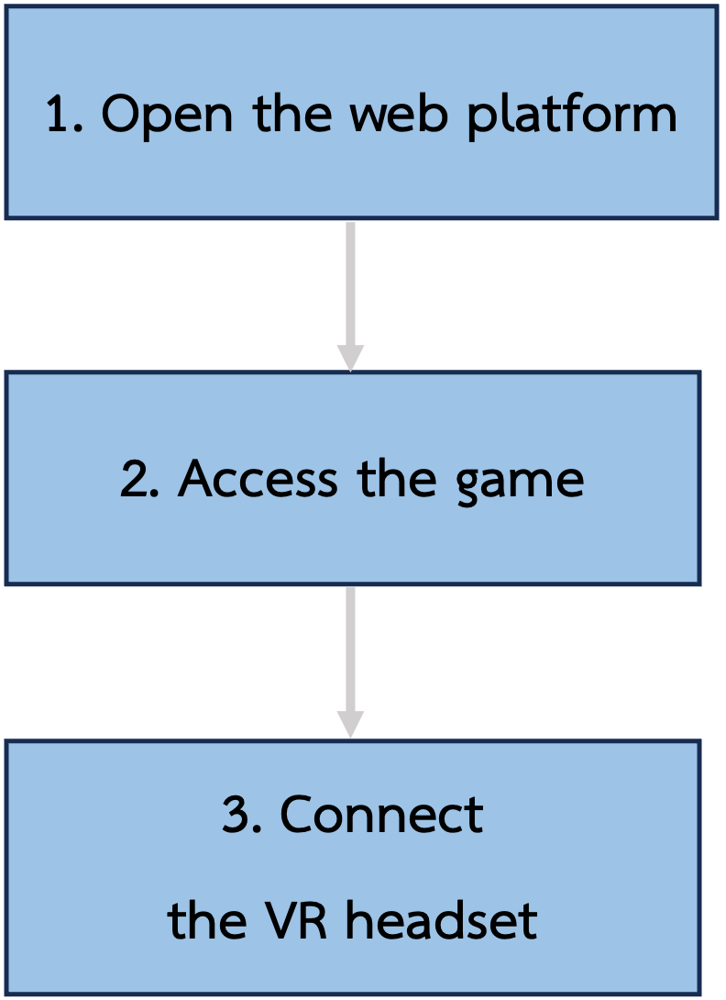
   </a>


According to the flowchart above, these are the steps for preparing the system and equipment before starting the game. \
The details for each step are as follows:

#### **1. Open the Web platform**

Open a terminal and run the command below to generate a URL for the web platform.\
Then copy that URL and open it in your web browser.

```bash
 cd /path/to/simple.webplatform/
 npm start
```

Open the web platform and select **Forest Monitoring**


#### **2. Accessing the game (VR)**

- 2.1 Launch the VR application

   After the player puts on the VR headset, make sure it is connected to the same Wi-Fi network as the computer.\
   Then, select the **“BiodiVRestorer 2”**  application on the headset.

- 2.2 On the first screen, players can **change the language (Thai or English)**, then select the **Online version**.
  
   <a id= "first_page" href="Pictures/in_game.jpg">
         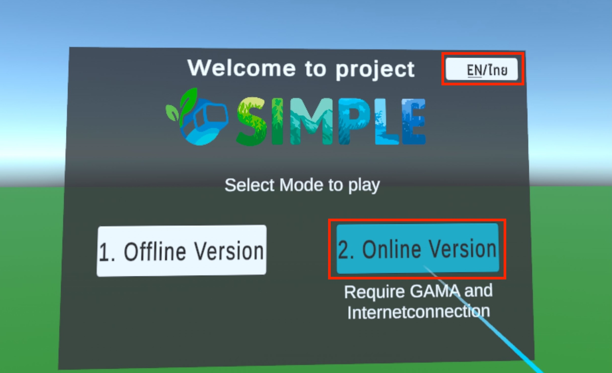
   </a>

- 2.3 On the next screen, players must enter **the IP and Port** of the host machine running the Web Platform and GAMA.

   <a id= "IP_page" href="Pictures/IP_Port.jpg">
         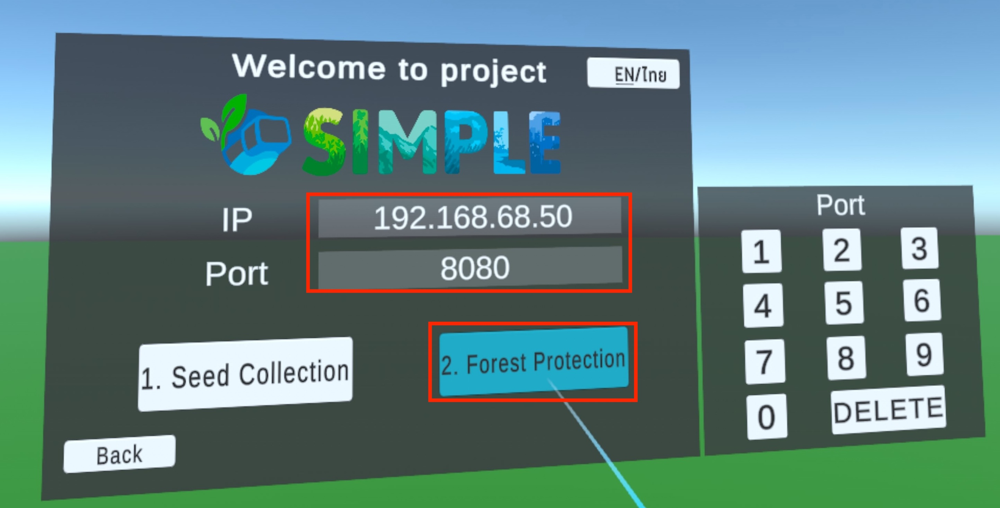
   </a>

- 2.4 The player is then taken into the game


#### **3. Connecting the VR**

- 3.1 Check VR connections from the web platform

Click the VR headset icon on the webplatform to check the connection status of each player.

   <a id= "check-vr-connect" href="Pictures/check_vr.png">
         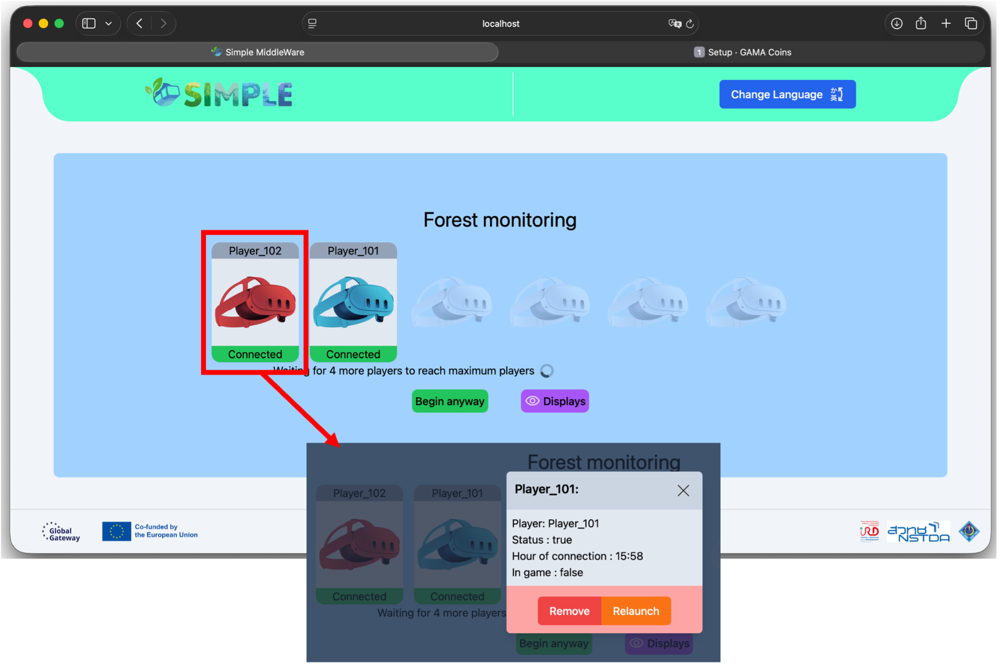
   </a>

- 3.2 Once you have confirmed that all players are connected, 
you can click the  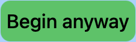  button to call the **Forest Monitoring** Simulation.

   


<!--
1. Open the Web platform

Open a terminal and run the command below to generate a URL for the web platform.\
Then copy that URL and open it in your web browser.

```bash
 cd /path/to/simple.webplatform/
 npm start
```

2. Select a scenario

Open the web platform and select **Forest Monitoring** as shown in the following figure.   

   <a href="Pictures/scenario_game.png">
         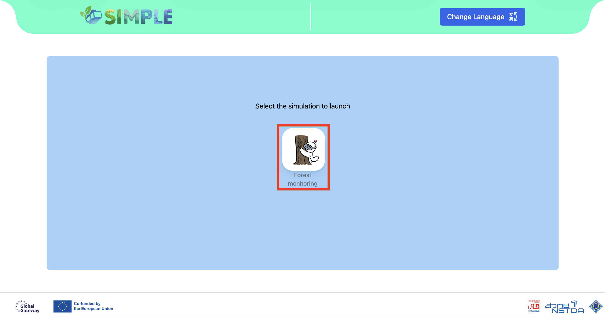
   </a>


3. Launch the VR application

After the player puts on the VR headset, make sure it is connected to the same Wi-Fi network as the computer.\
Then, select the **“BiodiVRestorer 2”**  application on the headset.

 <a id= "VR_app" href="Pictures/open_app.jpg">
         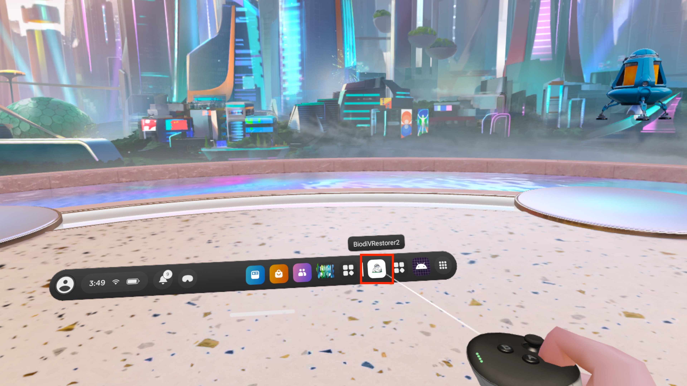
   </a>


4. Check VR connections from the web platform

Click the VR headset icon on the webplatform to check the connection status of each player.

   <a id= "check-vr-connect" href="Pictures/check_vr.png">
         
   </a>


5. Wait for GAMA to launch and start the model

Once you have confirmed that all players are connected, 
you can click the **“begin anyway”** button to call the **Forest Monitoring** Simulation.

   <a id= "begin-anyway" href="Pictures/begin_anyway.png">
         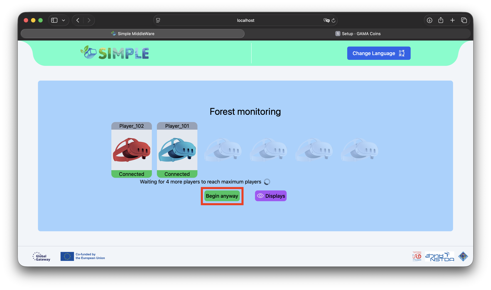
   </a>

6. Accessing the Forest Protection

   When players launch the game, they first arrive at the Welcome screen.

6.1 On the first screen, players can select the game mode and change the language (Thai or English).
   Then, select the Online version.

<a id= "first_page" href="Pictures/in_game.jpg">
         
   </a>


6.2 On the next screen, players must enter the IP and Port of the host machine running the Web Platform and GAMA.\
   For example:
- IP: 192.168.68.51
- Port: 8080

After entering the IP and Port, select **2. Forest Protection**.

<a id= "IP_page" href="Pictures/IP_Port.jpg">
         
   </a>

6.3 The player is then taken into the game, where a UI screen allows them to press **“Ready”** to indicate that they are prepared.

<a id= "ready_UI" href="Pictures/ready.jpg">
         
   </a>


7.  Start the tutorial

Check that all players are ready, then click the **“Play”** button on the web platform to start the tutorial.\
In the tutorial, players will practice three basic skills needed in the game

<a id= "play-sim" href="Pictures/play_sim.png">
         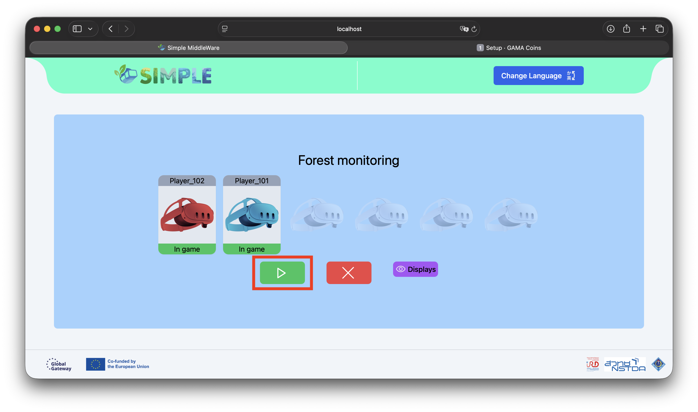
   </a>

The following flow is the overall workflow of Forest Monitoring, starting from the tutorial to the end of the game.

<a id= "work_flow" href="Pictures/workflow_in_game.png">
         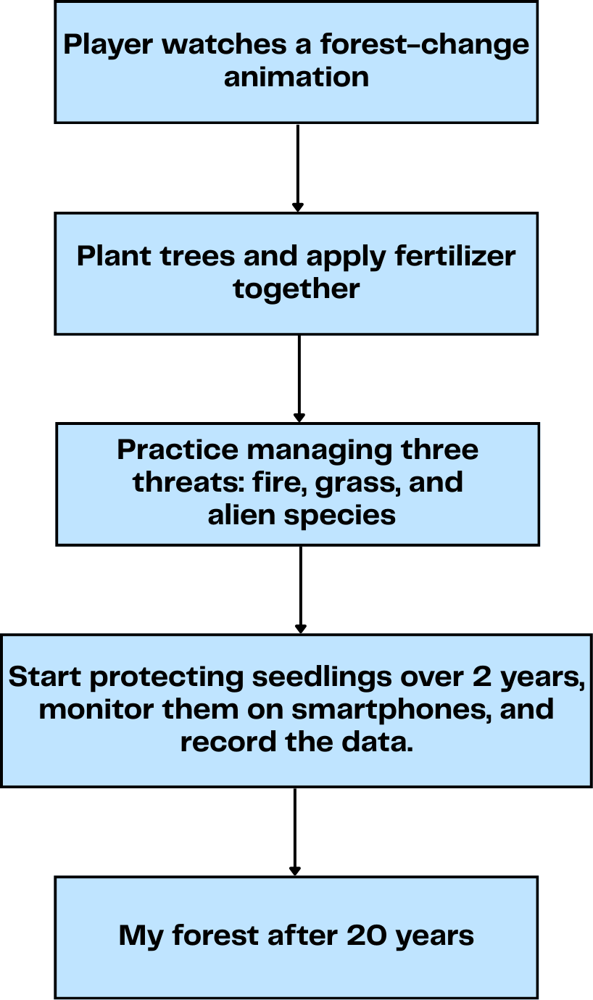
   </a>

<!--
7.1 The player first sees an animation showing the surrounding forest gradually degrading.

7.2 When the animation ends, a UI screen appears asking the player to press **“Begin”**.

   <a id= "begin_vr" href="Pictures/begin_vr.jpg">
            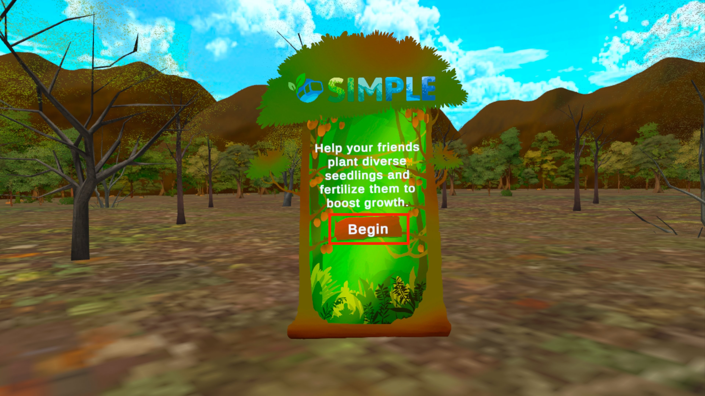
      </a>

7.3 After pressing **“Begin”**, the tutorial starts. In this tutorial, the player will: 

- Plant one tree.

<a id= "plant_tree" href="Pictures/planted_1tree.jpg">
         
   </a>

- Practice handling all three types of threats.

   <a id= "plant_tree" href="Pictures/threat.png">
            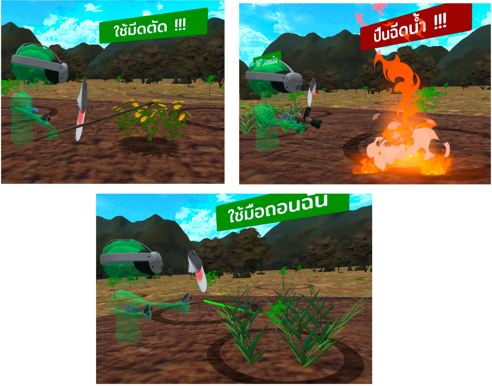
      </a>

7.4 When the tutorial is complete, the player is asked to fill out a short questionnaire.

7.5 After submitting the questionnaire, a UI screen appears asking the player to wait until all other players are ready, 
   so that everyone can start together.

   <a id= "UI_wating" href="Pictures/waiting_ui.jpg">
            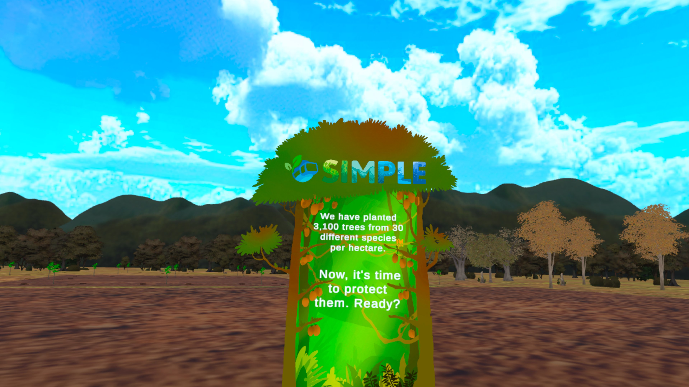
      </a>

8. Start the main simulation (4-minute/plot)

After all players have completed the tutorial, check that everyone is ready. \
Then click [**“Play”**](#play-sim) on the webplatform again (as in Step 7) 

When players enter the main game, they must walk around the forest and use tools to remove three types of threats: grass (weeds), \
alien species, and fire. Each plot lasts 4 minutes. In addition, players have a limited number of coins, \
which must be spent through the web application to reset threats, so they need to plan their coin usage carefully.

9. Repeating Rounds for All Players

Repeat steps 7 – 8 as needed, depending on the number of students (Max 6 player)\
and how many times you want them to play,\
so that all players have the opportunity to fully participate.

At the end of each game round, players can press the **“Show Result”** button to view their own outcomes from protecting the forest.\
The result screen presents one of three possible scenarios, depending on the player’s final score.

   <a id= "show_result" href="Pictures/show_result.jpg">
            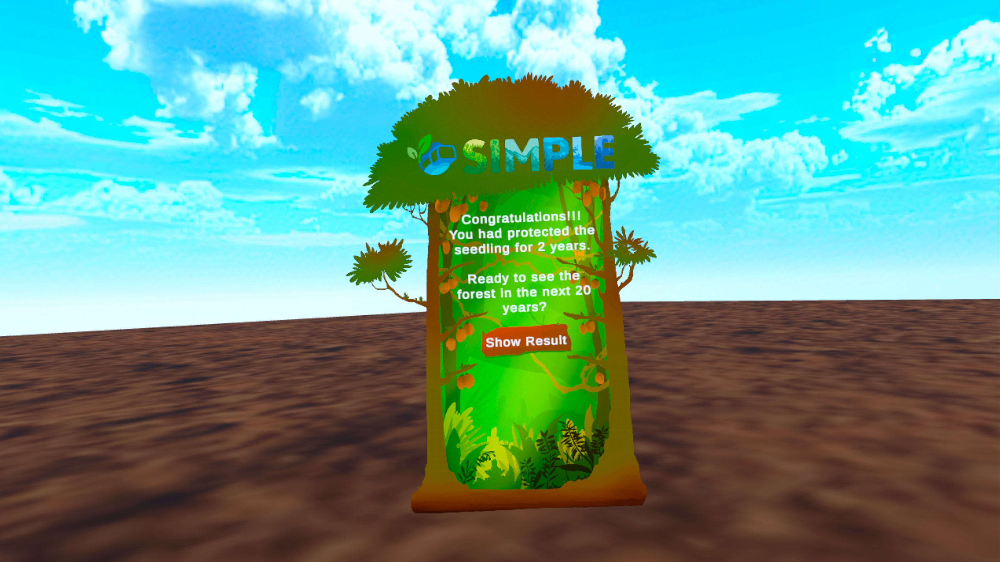
      </a>

After reviewing their results, players are asked to complete a short questionnaire.

Then, a “Thank you” UI screen appears, prompting the player to remove the headset and pass it to the next participant.

   <a id= "thank_ui" href="Pictures/thankyou_ui.jpg">
         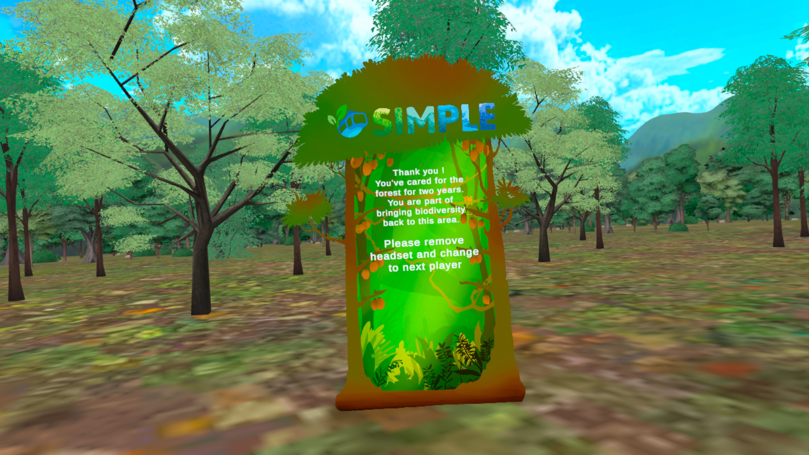
   </a>

10. End the simulation and return to the home page

When the simulation has completed and you want to return to the web platform’s home page,\
click the red cross button on the web platform to stop the simulation in GAMA and prepare for the next session.

   <a id= "end-simulation" href="Pictures/end_sim.png">
            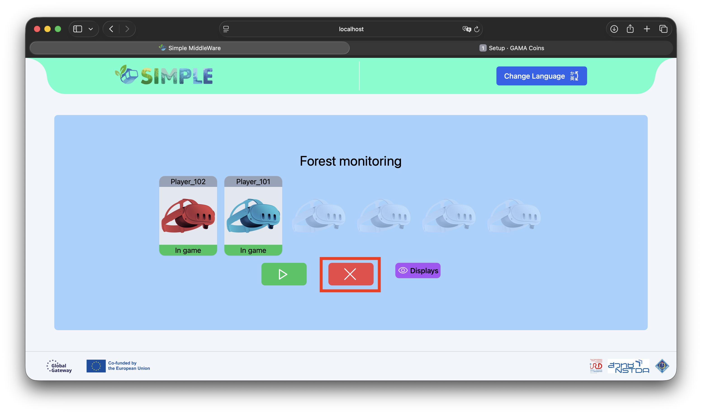
      </a>
-->
---

### Game Play

   <a href="Pictures/flow2.png">
         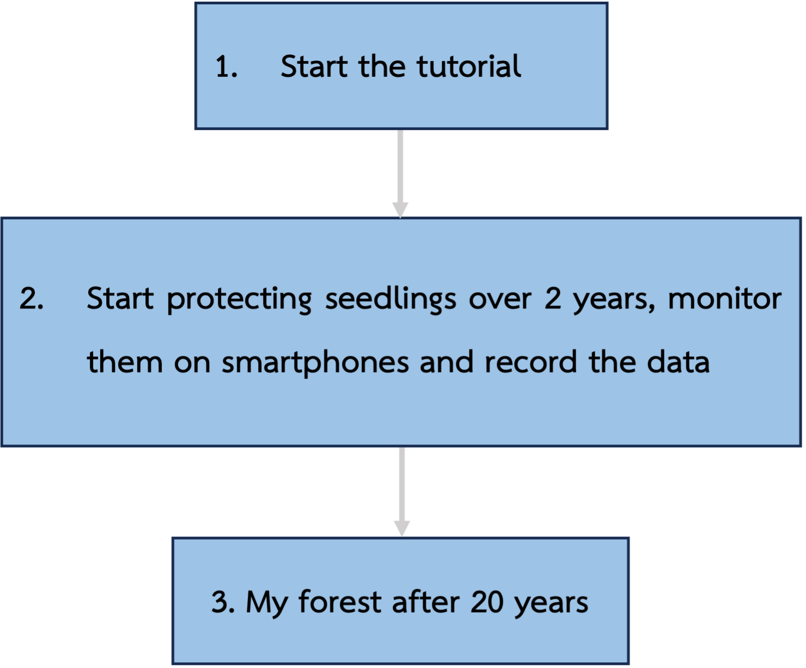
   </a><br><br><br>

The flowchart above summarizes the gameplay steps, which are described below.

Check that all players are ready, then **press   on the web platform** to start the tutorial. <br>

#### **1. Strat the tutorial**

- 1.1 Player watches a forest-change animation

- 1.2 Plant trees and apply fertillizer together

- 1.3 Practice managing three threats: Fire, Alien, Grass

Check that everyone is ready, then **press   on the web platform** to start protecting seedlings<br>

#### **2. Strat protecting seedlings over 2 years**, monitor them on smartphones and record the data

When players enter the main game, they walk around the forest and use tools to remove three threats: grass (weeds), alien species, and fire. Each plot lasts 4 minutes, and players have limited coins, spent via the web application to reset threats, so they must use them wisely. After each round, the VR headset is passed to the next player until everyone has played, with the number of rounds matching the number of players (up to six per group).

#### **3. My Forest after 20 years**

At the end of each game round, players can press the **“Show Result”** button to view their own outcomes from protecting the forest. The result screen presents one of three possible scenarios, depending on the player’s final score.

---

### Basic Controls

#### For GAMA Models
Users interact with the GAMA interface mainly by **left-clicking** on the available control buttons:

1. **Play / Pause experiment** (keyboard shortcut: `Command + P` or `Control + P`)
2. **Close experiment** (keyboard shortcut: `Shift + Command + X` or `Shift + Control + X`)
3. **Reset** button — used when a player loses connection 
4. **Reload** button — used when a player loses connection 

      <a  href="Pictures/GAMA_control_new.png">
            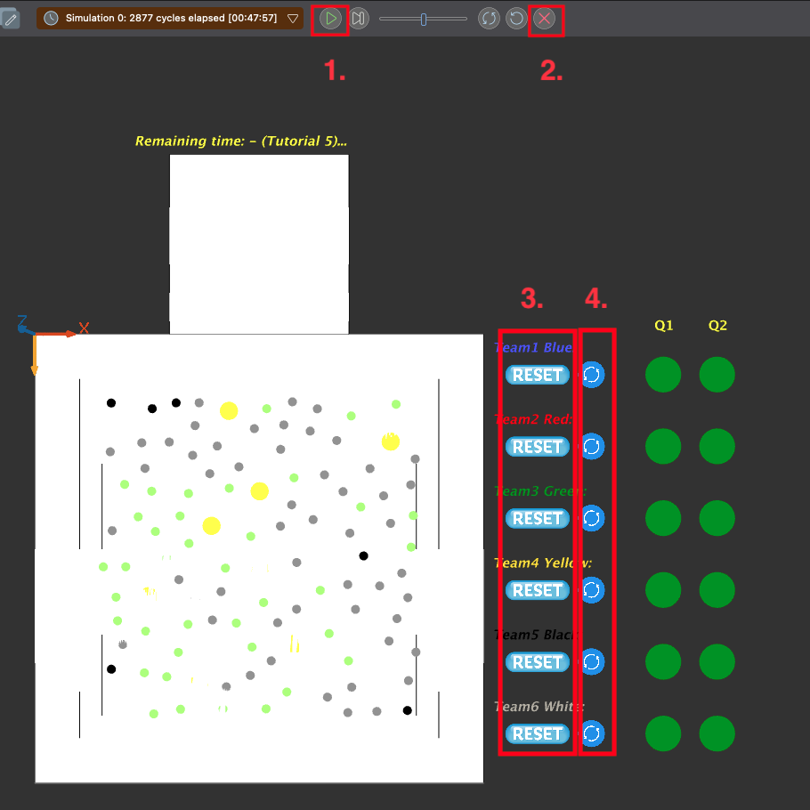
      </a>

#### For Unity VR Games
- **Movement**: 
   - Use the **left thumbstick** to move forward and backward.
- **Interaction**: 
   - Use the **right trigger button** (index finger) to fire the crossbow.
   - Use the **right grip button** (middle finger) to pick up or grab objects.
- **Menu Access**: 
   - Press the **Meta / Oculus button** on the right controller to open the main menu and exit the game.

   <a href="Pictures/VRGameControl.png">
         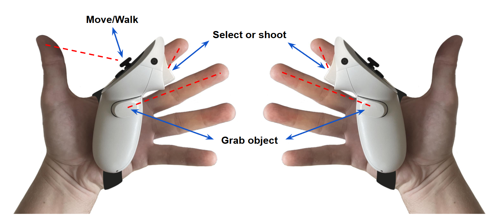
   </a>


#### For Web Platform
1. **Play / Pause Button** 
2. **Close Button**

   <a id= "play-pause" href="Pictures/play_pause.png">
         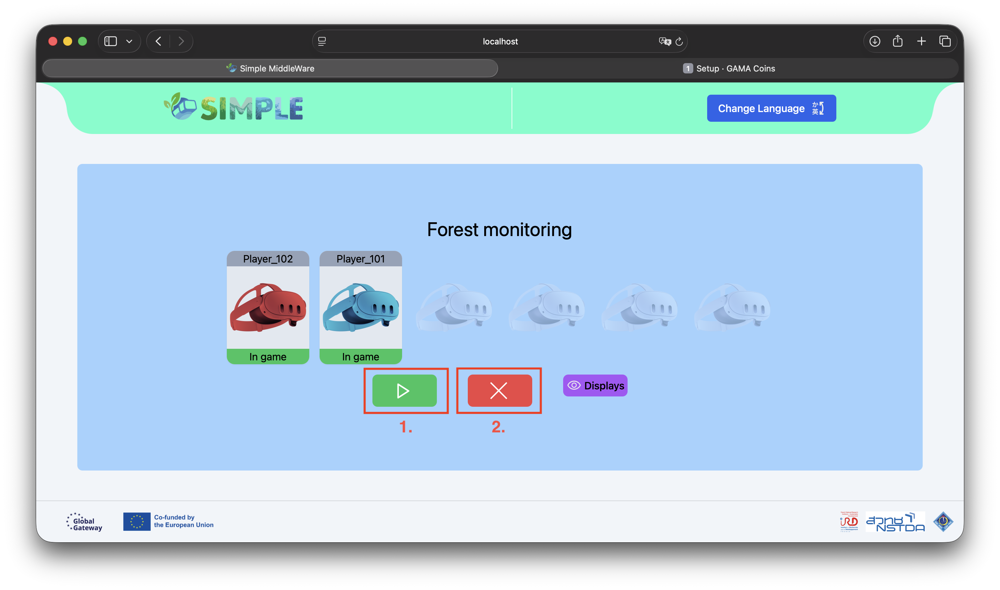
   </a>

3. **VR headset Status Checking**   
   See the figure [Check VR connections](#check-vr-connect) 

#### For Web application

- **For Student**

   <a id= "reset_button" href="Pictures/reset_web.PNG">
      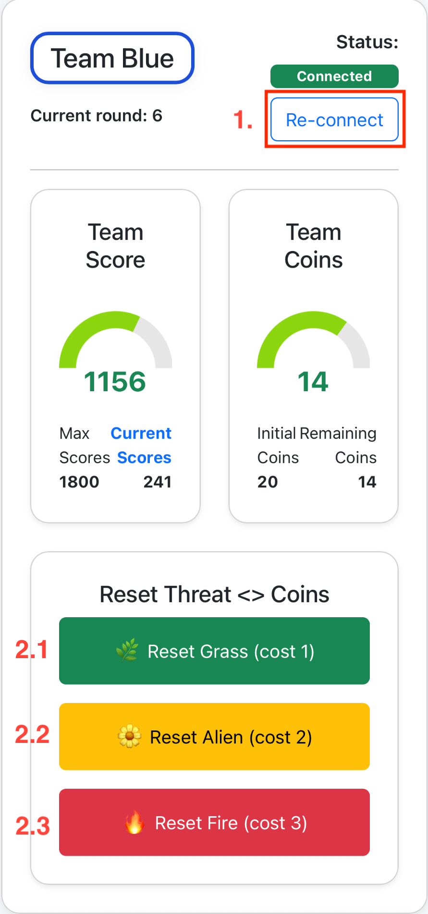
   </a>

   1. **Re-Connect Button**

      If the web application disconnects from GAMA, click the “Re-connect” button to connect again.

   2. **Reset Threat coins** 

      These buttons use coins to reset different threats. The coins in the system will be deducted according to the type of threat you reset:

      2.1 **Reset Grass**: costs 1 coin\
      2.2 **Reset Alien**: costs 2 coins\
      2.3 **Reset Fire**: costs 3 coins

     
- **For Teacher**
   
   1. **Numeric stepper**\
      This field is used to set the number of coins for each team. \
      The teacher can either type a value directly or use the + and – buttons to increase or decrease the number.

   2. **Reset all to zero button**\
      Click “Reset all to zero” to set the coin values of all teams back to 0.

   3. **Submit Button**\
   Click “Submit” to confirm the updated values and send them to the system (this also unlocks the links for each team).

      <a id= "setup_coin" href="Pictures/setup_coin.png">
            
      </a>


   4. **Links for each team**
      After clicking Submit, the web application links for all teams will appear, including:
      - **Link**: a direct link for each team that can be opened immediately.
      - **Copy button**: copies the team’s link to the clipboard so it can be opened in a browser.
      - **Open button**: opens the team’s link in a new browser tab.
      - **QR button**: shows a QR code for the team’s link, which each team’s representative can scan to open their team page.

      <a id= "link_coin" href="Pictures/link_coin.png">
               
         </a>

---

## Using the Virtual Universe

### Main Features
<!--
#### Exploration Mode
[Describe how users can explore the virtual environment]
-->

#### Learning Modules
1. **Module 1: Forest Monitoring** (With VR)
   - Duration: approximately 40 - 60 minutes

   - Objectives: 
      - Help learners understand why the first few years of seedling growth are critical for forest restoration.
      - Practice making decisions under limited resources (coins) to manage threats.

   - Activities: 

      During the session, one student wears the VR headset and enters the Forest Protection mode, \
      walking around the forest, using tools to remove three types of threats (grass, alien species, and fire), \
      and managing a limited number of coins to protect the seedlings. In each round, \
      the other team members observe the gameplay and record the round score and \
      the number of remaining trees for each species using the web dashboard and a worksheet. \
      At the end, the team reviews their notes together with the dashboard visualizations to \
      reflect on their strategies and how their decisions affected forest restoration.

#### Interactive Elements
- **Environmental Indicators**: 

1. **Time Indicator**

   1.1 **Yearly indicator**  
   - **Rainy season**: the rainy season is used as a visual and audio cue for the time of year. \
    When the rainy season begins, players can hear rain, thunder, and lightning sounds, and see rainfall in the forest.

   1.2 **In-game time**  
   - **4 minutes (2 years)**: the play time for one plot is 4 minutes, \
   which represents 2 years of seedling monitoring and forest restoration in the simulation.  
   - **1 minute remaining (sound)**: when there is only 1 minute left in the round, \
   a voice effect saying *“1 minute remaining”* is played to alert the player that the round is about to end.

      <video src="video/1min_remain.mp4" width="250" controls></video>


2. **Score**

   Players can observe the surrounding forest environment, which appears in one of three conditions depending on their current score. In each round, the maximum score is 300 points, and the surrounding forest environment is divided into three levels based on score ranges as follows:

- ***Level 1 of forest degradation***: \
   This is the healthiest condition of the forest, with high biodiversity and lush vegetation. \
   The player’s current score is in the range **[240–300]**.

   <a id= "level1" href="Pictures/level1.PNG">
      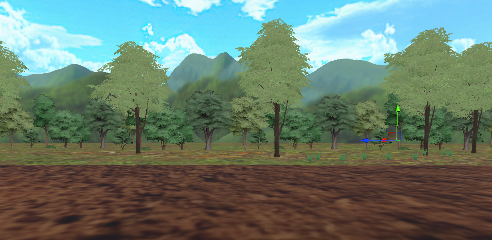
   </a>

<!--
~~Players may notice elephants or other wildlife in the area.~~
-->

   - ***Level 2 of forest degradation***: \
      This represents a moderately healthy forest, but the forest is not as rich or dense as in Level 1. \
      The player’s current score is in the range **[150–240)**.

      <a id= "level2" href="Pictures/level2.PNG">
         
      </a>

<!--
~~Players may see bears or some wildlife~~
-->

   - ***Level 3 of forest degradation***: \
      This is the most degraded condition. The forest is open and sparse, \
      with very low biodiversity, and players can see signs of disturbance such as smoke from fires. \
      The player’s current score is in the range **[0–150)**.

       <a id= "level3" href="Pictures/level3.PNG">
         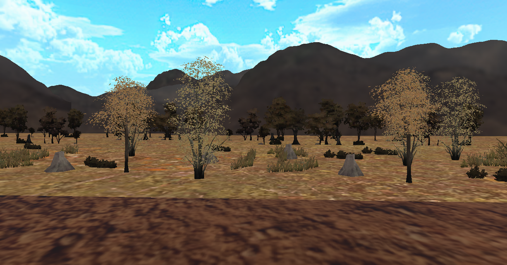
      </a>

   
<!--
During gameplay, the environment reflects the current state of the forest according to the player’s actions.
   ~~At the end of the game, or when pressing Show Result,
   the environment shows the forest condition 20 years later, 
   illustrating the long-term impact of the player’s restoration decisions.~~
-->

1. **Threat**
   - Fire
      - When a forest fire occurs, the player’s VR view shows **floating fire** particle effects 
         around the edges of the screen, alerting them that a fire has started.

         <br><br>

      - At the same time, a burning **fire sound effect** is played to further notify the player of the ongoing fire.
  
         <video src="video/fire_sound.mp4" width="250" controls></video>

      - In the game, forest fires can appear in three main forms:
         - a campfire 

            <br><br>

         - fireballs

            <br><br>

         - flames burning on trees
         
            <br><br>

      - When the player uses the **water gun** to extinguish the fire,
       a progress bar appears, indicating how close they are to successfully putting out the fire.

         <br><br>

   - Grass and Alien species
  
	   - When a tree is exposed to more than 4 threats (including both grass and alien species), \
      an **icon of a “startled tree”** appears to alert the player to come and protect that tree.
      
          <br><br>


	   - When a tree is exposed to more than 6 threats, the tree shows a **“crying tree” icon** 
      
         <br><br>

      - At the same time, a **“help” voice effect** is played, as illustrated in the clip below. \
         This continues until the player removes the threats; if they do not arrive in time, the tree will die.

        <video src="video/icon_tree_cry.mp4" width="250" controls></video><br><br>

	   - When the player removes weeds or alien species, a **cutting sound effect** is played to indicate that \
       the grass or alien species has been successfully cleared.

         <video src="video/cut_alien.mp4" width="250" controls></video><br><br>

   

- **In-Game Activities**:

   Handling the three types of threats:

    - **Extinguishing fire**\
      Raise your left arm and look at it,  
      and use your right middle finger to pick up the water gun.
      Then, use your left index finger to spray water and extinguish the fire.

      <a id= "water_gun" href="Pictures/water_gun.png">
         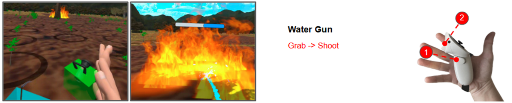
      </a><br><br>

   - **Removing alien species**\
   Raise your left arm and look at it. You will see two tools attached to your arm.
   Use your right middle finger to grab the harrow.
   Then, use the harrow to remove the alien species, being careful not to hit any seedlings.

      <a id= "alien_species" href="Pictures/grass_cut.png">
         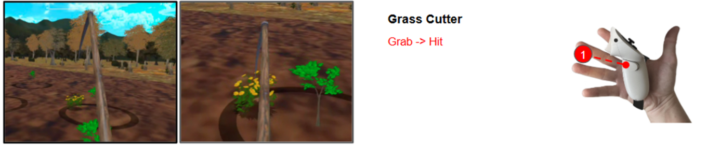
      </a><br><br>

	- **Removing grass (weeds)**\
      Use your left thumb to move towards the grass. Once you are close enough,
      use your right middle finger to pull out the grass.
  
      <a id= "weed" href="Pictures/weed.png">
         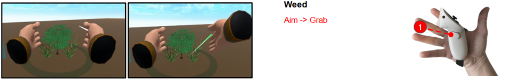
      </a><br><br>
   


- **Agents**: 

   <a id= "agent" href="Pictures/agent_new.png">
      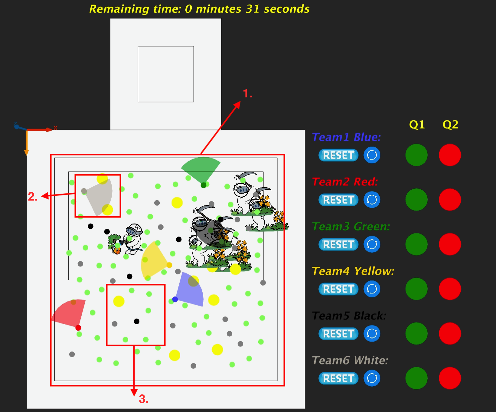
   </a><br><br>

   1. **Map**:
   It displays the playing area, showing the locations of trees and the positions of different threats (grass, alien species, and fire) around the seedlings.

   2. **Tree**:
   Each tree (or seedling) is an agent with its own growth state. Trees can grow, survive, or die depending on how well players protect them from threats during the game. Trees are represented by different colors:
      - Green: newly planted trees that can still grow.
      - Yellow: large, existing trees in the plot that can no longer grow.
      - Gray: a tree for which at least one team has caused the tree at that position to die; it turns black when all teams have caused the tree at that position to die.

   3. **Player**:
   Represents the team member who is currently wearing the VR headset. Each player is shown as a colored circle (red, green, yellow, blue, black, or white). 
   The cone shape extending from the player indicates the direction they are facing.


- **Data Visualization**:

   - **GAMA**
      - **Graph**

         <a id= "total_score" href="Pictures/Graph_GAMA_total.png">
            
         </a>

         * Total Scores: a horizontal bar chart showing the total score of each team.


      - **Map**

         <a id= "map_gama" href="Pictures/map_visual.png">
            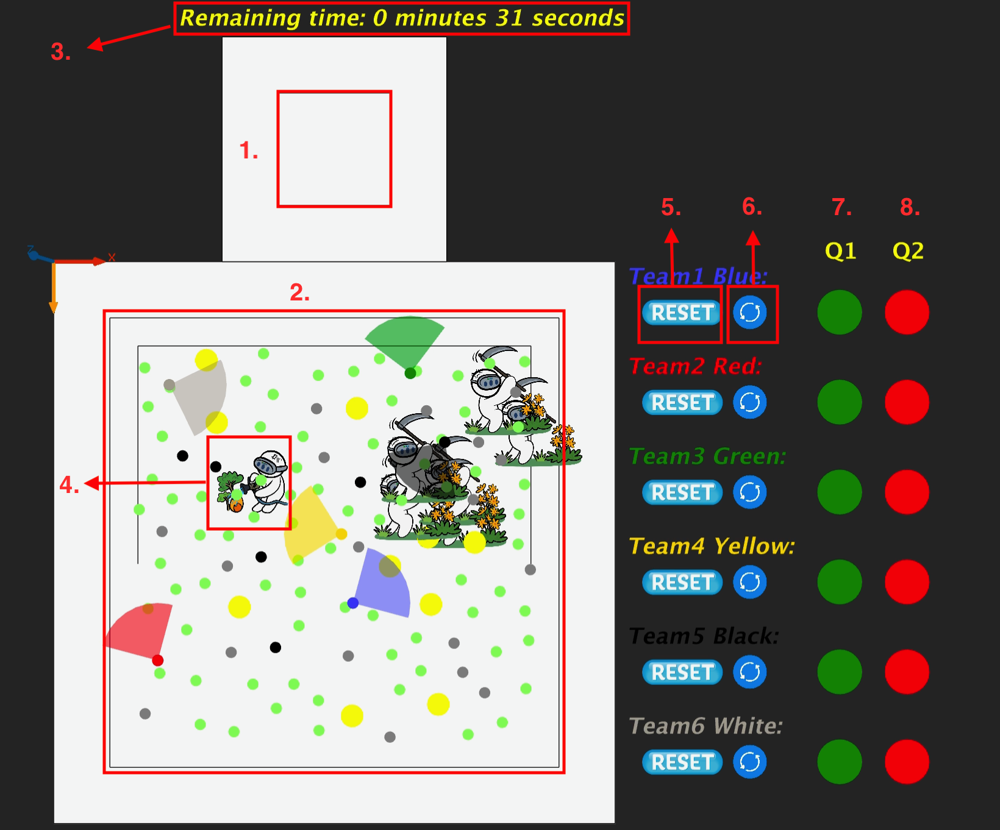
         </a><br><br>

         1. **Tutorial zone**:
            The area where players practice basic skills before the main game,
            such as picking up tools to remove threats and pulling out grass by hand.

         2. **Playing area**:
            The main forest area where seedlings, existing trees, 
            and threats (grass, alien species, and fire) are located during the game.

         3. **Remaining time**:
            A timer showing how much time is left in the current round.

         4. **Threat icons**:
             Icons indicating the locations and types of threats (grass, alien species, and fire) on the map.

         5. **Reset button**:
            Used when a player is disconnected. It sends the current game state back to Unity, for example to send the player to the tutorial again, to start the game, or to stop the game. Typically, the Reset button is pressed after the Reload button.

         6. **Reload button**:
            Used when a player is disconnected to send them back to the IP input screen, so they can reconnect and enter the game again.

         7. **Q1 – Pre-game questionnaire**:
            Used to check whether the player has completed the pre-game questionnaire.
            * Green circle = questionnaire completed
            * Red circle = questionnaire not yet completed

         8. **Q2 – Post-game questionnaire**:
            Used to check whether the player has completed the post-game questionnaire, 
            in the same way as Q1 (indicated by a green or red circle).

   - **Web application**
      - **For Student**
         - **Team Name**: \
           In the first section, the interface displays each team’s name and indicates which plot they are currently playing.

            <a id= "team_name" href="Pictures/team_name.PNG">
               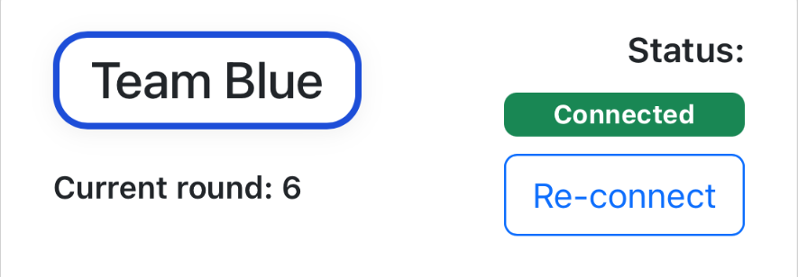
            </a>

         - **Team score**:
            - Max score: is the highest total score that a player can achieve.
            - Current score: the score of the current round for each team,
               based on how well they protected the forest and seedlings from different threats.

         - **Team coins**:
            Displays the number of coins that each team has. Coins are used as a limited resource to remove threats.  
            - Initial coins: the number of coins given to the team at the start of the game
            - remaining coins: the number of coins left after the team has spent them on actions such as resetting grass, alien species, or fire.

               <a id= "team_score_coin" href="Pictures/team_score.PNG">
                  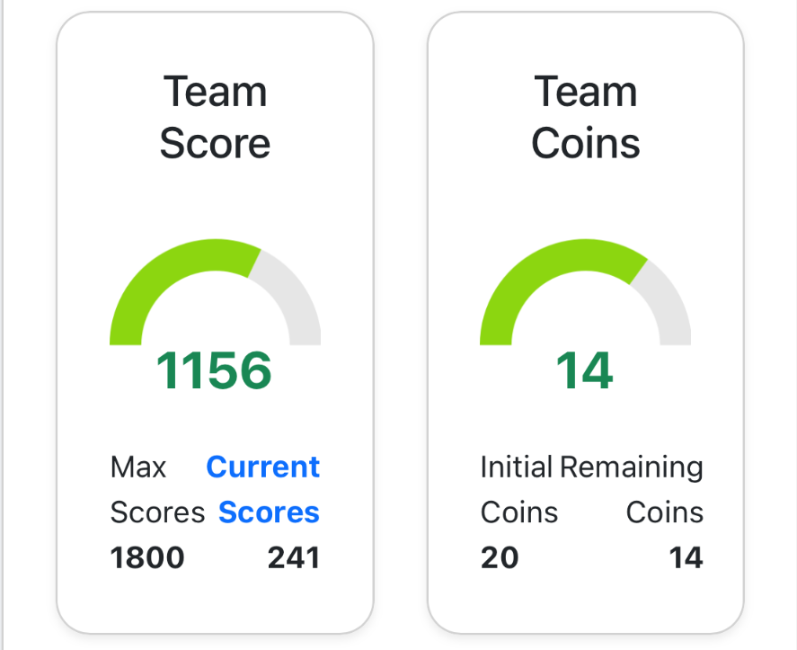
               </a>

         - **Number of remaining trees by species**: \
            A horizontal bar chart showing how many trees are still alive, grouped by species.  

            <a id= "remain_tree" href="Pictures/remain_tree.PNG">
               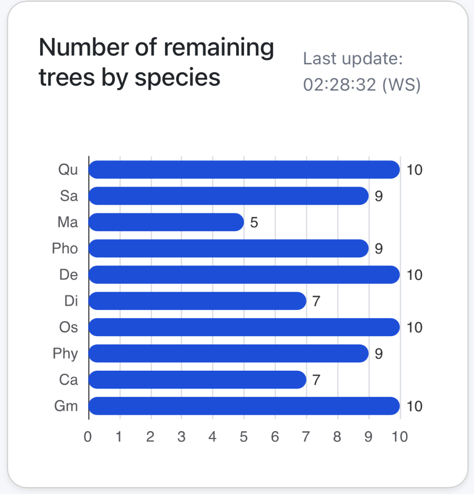
            </a>

         - **Tree Growths Stage Overview**: \
            A bar chart showing the number of trees in each growth stage (e.g., Stage 1, Stage 2, Stage 3).  
            This helps students see the overall structure of the forest: how many trees are still young, how many are in the middle stage, and how many have reached the final growth stage.

            <a id= "tree_growth" href="Pictures/tree_growth.PNG">
               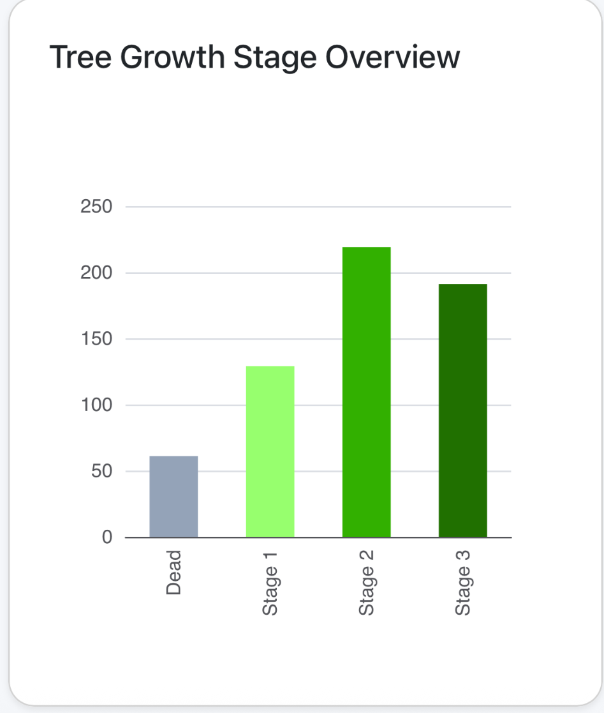
            </a>

         - **Stack Remaining trees by growth state round**: \
            A stacked bar chart showing the proportion of remaining trees in each plot, separated by growth stage (Stage 1–3).  
            This allows students to quickly see, for each plot, what percentage of trees are still alive and in which growth stages.

            <a id= "stack_tree" href="Pictures/stack_tree.PNG">
               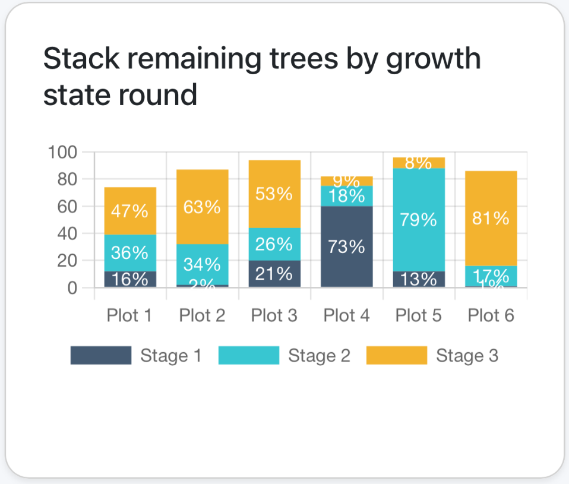
            </a>

   
      - **For Teacher**

         <a id= "leading_board" href="Pictures/lead_board_new.png">
            
         </a>

         1. **Team score**: (left)\
         A summary view of the total scores for all teams. 
         This allows the teacher to compare team performance, discuss strategies, 
         and use the scores as a basis for reflection or debriefing.

         2. **Team coins**: (right)\
         An overview of the initial and remaining coins for each team. 
         This helps the teacher see how students used their resources, 
         and how resource management affected their final outcomes.

<!--
- **Scenario Controls**: [How to modify parameters]
-->

<!--
### Simulation Controls (GAMA Specific)

#### Running Simulations
1. Select scenario from webplatform
2. Click "Run" to start simulation
3. Monitor indicators in real-time

#### Parameter Adjustment
- **[Parameter 1]**: Range [X-Y], affects [outcome]
- **[Parameter 2]**: Range [X-Y], affects [outcome]
- **[Parameter 3]**: Options [A/B/C], changes [behavior]
-->

### Game Progression 

#### Tree Growth Stages 

The tree growth in this model is based on a logistic growth equation and is divided into three stages:

- **Stage 1 – Seedling**  
  Young seedlings at an early growth stage.

- **Stage 2 – Intermediate growth**  
  Trees in a medium growth stage. 

- **Stage 3 Best 2-year growth** \
  Trees that have reached their best possible growth within the 2-year simulation period.
  

#### Achievement System
<!--
- [List achievements and how to unlock them]
-->
- **Progress tracking**

   - **GAMA** \
      A real-time graph displaying the total scores, as shown in the [total score graph](#total_score)

   - **Web application**
      - For student
      Other team members can track the game progress through the web application, which displays:
         - [Team score and team coins](#team_score_coin)
         - [Tree Growths Stage Overview](#tree_growth)
         - [Stack Remaining trees by growth state round](#stack_tree)
         - [Number of remaining trees by species](#remain_tree)

      - For teacher \
       A [leading board](#leading_board) that displays each team’s total score and remaining coins.

- **Coin Spending**
   - **Seedling Guardian Console** (web appication)\
      Within the Forest Monitoring session, each team walks around the forest to protect seedlings from all three types of threats. \
      Sometimes, players may not be able to handle every threat in time, so the Seedling Guardian Console is provided \
      as a support tool to reset threats in the forest at the cost of team coins. The number of coins spent depends on \
      the type of threat—for example, resetting all fires in the forest costs 3 coins \
      from that team’s total (as shown in the [Reset Threat coins](#reset_button) section above).
   
---

## Educational Features

### Learning Assessment

- **Pre-activity questionnaire** \
   After completing the tutorial practice, a short in-game UI questionnaire with two questions is shown for students to answer.

- **In-activity checkpoints** \
   During gameplay, the views shown in GAMA and the Seedling Guardian Console display how each team responds to the three threats wildfires, alien species, and weeds along with real-time team scores, remaining coins, tree growth stages, and other  described in the [Achievement System](#achievement-system). These indicators act as in-activity checkpoints, helping teachers and students see, while the game is still running, how well players prioritize threats, manage resources, and protect the forest.

- **Post-activity evaluation** \
   After playing, students complete a post-game questionnaire to reflect on their experience and what they have learned.

- **Progress reports for educators** \
 At the end of the game, each player sees one of three possible forest outcomes, based on their final score and the level of forest degradation. These outcomes can be used by educators to discuss performance and learning results.

- **Shared scenarios** \
   All teams experience the same forest scenario and identical threat settings, 
   which not only makes it easy to compare strategies and outcomes across groups,
    but also allows the shared scenario to reveal how each team chooses to respond to fires or alien outbreaks, 
    why some forests end up healthier than others, 
    and how students might change their strategy if they played the same scenario again.

### Collaborative Features
<!--
- Multiplayer mode (if applicable)
- Discussion forums
-->

- Group challenges
   - **Competetion** \
   During gameplay, both students and teachers can observe each team’s total score in GAMA. \
   The teacher’s web application (Seedling Guardian Console) also shows each team’s score and remaining coins in real time, \
   which can stimulate competition between teams. Even in this competitive environment, \
    each team still needs to discuss internally how to respond to wildfires, grass, and alien species, \
   turning competition into a driving force for collaboration within the group.

   - **Collaboration** \
     While playing, students practice teamwork by recording data after each round (e.g., scores and remaining trees by species) and making joint decisions on how to spend coins to remove threats. The coin system on the Seedling Guardian Console lets team members who are not wearing the VR headset actively help by managing coins and choosing when to reset threats. When the VR view is cast onto a shared screen, the whole team can watch the same scene, discuss what is happening in the forest, and adjust their strategy together in real time.

### Educational Resources
<!--
- In-app glossary
-->

- Work sheets
   - Activity worksheets are provided for students to record information during gameplay, \
   including each player’s score for the current round and the number of remaining trees for each species.

- External links to resources
<!--
 slide canva
-->

- Teacher's guide availability

---

## Troubleshooting

### Common Issues and Solutions

#### VR-Specific Issues
**Problem**: One headset turned-off during a game \
**Solution**:
- Turn it back on
- Reopen the game
- Auto-magically reconnecting

**Problem**: Unable to connect to GAMA during a game \
**Solution**:
- Reopen the game
- Restart GAMA or Middleware

---

## Frequently Asked Questions

### General Questions

**Q: Can I use this offline?**\
A: No.

**Q: How do I save my progress?**\
A: No.

**Q: Is this available in my language?**\
A: Available in Thai and English.

---

### Technical Questions

**Q: What VR headsets are supported?**\
A: Meta Quest 3 only.

**Q: Can I run this on a tablet/mobile device?**\
A: No.

---

### Educational Questions

**Q: How long does each session take?**\
A: The forest monitoring session takes approximately 40–60 minutes.

**Q: Can teachers monitor student progress?**\
A: Yes. Teachers can monitor progress in real time through the web application, \
which shows each team’s scores, team’s coins 

---

### Bug Reporting

Please report bugs through: [**GitHub issues page**](https://github.com/project-SIMPLE/simple.NSTDA.gama2/issues)

---

<!--
[**Coin System**](Web_Coin_System.md)
-->


